# LovelyGUI
A maneira mais simples e fácil de criar aplicativos GUI para Linux usando shellscript 

A maioria das aplicações utilitárias envolve pegar informações do usuário, processar e exibir ou salvar em disco, e a forma como as informações são captadas tendem a ser basicamente as mesmas porém em layouts diferentes, esse kit trás os principais meios de captação de dados em módulos separados, basicamente tudo que você tem que fazer é pegar os módulos que sua aplicação precisa e pronto, simples assim, você pode focar no processamento dos dados

# Dependencias

 - `sed`
 - `cut`
 - `yad`
 
> Note que `sed` e `cut` geralmente vem pré instalados em praticamente todas as distribuições linux

# Configuração inicial

Requer apenas 2 passos:

1. Na pasta de fontes do seu projeto faça o download do LovelyShellGUI:

```bash
wget "https://raw.githubusercontent.com/sudo-give-me-coffee/LovelyShellGUI/main/src/LovelyShellGUI.sh"
```

2. Adicione essa linha no seu projeto:

```bash
. "$(dirname "$(readlink -f "${0}")")"/LovelyShellGUI.sh
```

E pronto, simples assim, o LovelyShellGUI está configurado, o proximo passo é configurar o seu projeto

# Configurando o seu aplicativo

Todo o LovelyShellGUI é configurado através de variáveis ambientes, as duas primeiras servem para descrever sua aplicação:

```bash
AppTitle="Minha Aplicação"
AppIcon="icone.svg"
```

Ao chamar a função `show` podemos ver o que essas variáveis fazem:

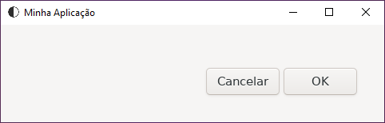

`AppTitle` define o título da janela e `AppIcon` define o ícone da janela

> Dica: Procure manter essas variáveis ambientes constantes

# Seu primeiro diálogo

> Embora você possa fazer de forma avulsa, o ideal é seguimentar cada diálogo em uma funçã

Uma vez configurado a base da aplicação, podemos investir nos módulos, vamos dar um titulo com a variável `DialogTitle` e uma descrição com a varíavel `DialogDescription` pro nosso diálogo e vamos exibir usando `show`:

```bash
function digaOi() {
  local DialogTitle="Olá mundo"
  local DialogDescription="Exemplo de diálogo"
  
  show
}
```

Então ao chamar a função `digaOi` temos a seguinte tela:

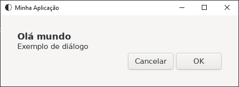

# Trabalhando com entradas do usuário

No exemplo anterior vimos como é simples contruir diálogos, agora vamos ser como é igualmente simples obter a entrada do usuário, para isso nós vamos definir o tipo de dado que queremos obter, para isso definimos a variável `DialogType` com o tipo desejado, por exemplo, podemos definir ela como `input` para pegar uma linha de texto com o nome do usuário:

```bash
function perguntaNome() {
  local DialogTitle="Qual o seu nome?"
  local DialogDescription="Digite seu nome no campo abaixo"
  local DialogType="input"
  
  show
}
```

Então ao chamar a função `perguntaNome` temos a seguinte tela:

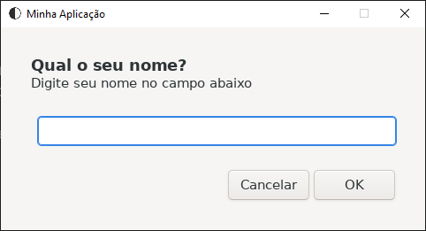


Note que a função `show` não devolve o que o usuário digitou, o LovelyShellGUI para impedir que o seu código fique poluído armazena os dados na variável global `DIALOG_OUTPUT`, então para obter a entrada do usuário basta pegar o conteúdo dessa variável, veja o mesmo exemplo, agora iniciando outro diálogo com a entrada do usuário:

```bash
function perguntaNome() {
  local DialogTitle="Qual o seu nome?"
  local DialogDescription="Digite seu nome no campo abaixo"
  local DialogType="input"
  
  show
  
  nome=${DIALOG_OUTPUT}
  
  local DialogTitle="Olá ${nome}, tudo bem?"
  local DialogDescription="Viu como é fácil obter a entrada do usuário usando LovelyShellGUI?"
  unset DialogType
  
  show
}
```

Nesse exemplo a variável `nome` recebe a saída da primeira caixa de diálogo (`${DIALOG_OUTPUT}`)

# Detectando o botão "Cancelar" e "Fechar janela"

O LovelyShellGUI foi pensado para tornar a manutenção do código simples e legível, pensando nisso a função `show` foi desenhada para gerir isso, ela retorna `1` quando o usuário clica em  "Cancelar" ou fecha a janela, sendo assim, basta usar o operador `&&` nela para que a próxima ação só seja executada caso o usuário não cancele a operação: 

```bash
function perguntaNome() {
  local DialogTitle="Qual o seu nome?"
  local DialogDescription="Digite seu nome no campo abaixo"
  local DialogType="input"
  
  show && {
    nome=${DIALOG_OUTPUT}
  
    local DialogTitle="Olá ${nome}, tudo bem?"
    local DialogDescription="Viu como é fácil obter a entrada do usuário usando LovelyShellGUI?"
    unset DialogType
  
    show
  }
}
```

Agora a segunda caixa só será exibida se o usuário não fechar a janela ou clicar em "Cancelar


# Trabalhando com diálogos que possuem mais de um campo

Alguns diálogos possuem mais de um campo, para facilitar o processo coloca o valor de cada campo em linhas separadas, assim basta pegar a linha correspondente ao campo, uma das formas de se fazer isoo é usar `variable=$(sed -n Xp <<< "${DIALOG_OUTPUT}")` onde `variable`é o nome da variável e `X` é o número da linha correspondente ao campo, veja o exemplo:

```bash
function perguntaHora() {
  local DialogTitle="Que horas pro alarme?"
  local DialogDescription="Use o formato 24 horas"
  local DialogType="time"
  
  show && {
    horas=$(sed -n 1p <<< "${DIALOG_OUTPUT}")
    minutos=$(sed -n 2p <<< "${DIALOG_OUTPUT}")
      
    local DialogTitle="Você escolheu ${horas} h e ${minutos} min"
    local DialogDescription="Viu como é fácil obter a entrada do usuário usando LovelyShellGUI?"
    unset DialogType
  
    show
  }
}
```

Consulte na seção "Tipos de diálogo" a documentação de cada diálogo para obter a linha correspondente a cada campo caso se aplique

# Trabalhando com diálogos tipo lista

O LovelyGUIShell possui diálogos tipo lista, tanto de texto puro como imagens, os elementos são colocados em um array chamado `DialogItemList` seguindo um padrão, para cada tipo de diálogo de lista existe um padrão a ser seguido, veja as demonstrações abaixo:

### `list`
```bash
DialogType="list"

# Certifique-se de esvaziar o array antes de adicionar items
DialogItemList=()
DialogItemList+=("Texto do item 1")
DialogItemList+=("Texto do item 2")
```

Nesse exemplo cada entrada no array corresponte a um item da lista, é o tipo mais simples de lista

### `checklist`
```bash
DialogType="checklist"

# Certifique-se de esvaziar o array antes de adicionar items
DialogItemList=()
DialogItemList+=(FALSE "Texto do item 1")
DialogItemList+=(TRUE  "Texto do item 2")
DialogItemList+=(FALSE "Texto do item 3")
```

Essa lista possui dois campos sendo o primeiro uma caixa de marcação e o segundo o texto do item, o valor `TRUE` significa que a caixa estará marcada por padrão e `FALSE` significa que a caixa estará desmarcada, o usuário poderá escolher multiplos elementos

### `radiolist`
```bash
DialogType="radiolist"

# Certifique-se de esvaziar o array antes de adicionar items
DialogItemList=()
DialogItemList+=(FALSE "Texto do item 1")
DialogItemList+=(TRUE  "Texto do item 2")
DialogItemList+=(FALSE "Texto do item 3")
```

A sintaxe é exatamente a mesma do `checklist` a diferença é que o `radiolist` permite que o usuário escolha apenas um item

### `image-list`
```bash
DialogType="image-list"

# Certifique-se de esvaziar o array antes de adicionar items
DialogItemList=()
DialogItemList+=("arquivo1.png" "Texto do item 1")
DialogItemList+=("arquivo2.png" "Texto do item 2")
DialogItemList+=("arquivo3.png" "Texto do item 3")
```

Essa lista também possui dois campos porém o primeiro recebe um nome de um arquivo de imagem e o segundo o texto do item, ela funciona de forma similar ao `list` porém permite especificar uma imagem para o item

### `image-checklist`
```bash
DialogType="image-checklist"

# Certifique-se de esvaziar o array antes de adicionar items
DialogItemList=()
DialogItemList+=(FALSE "arquivo1.png" "Texto do item 1")
DialogItemList+=(TRUE  "arquivo2.png" "Texto do item 2")
DialogItemList+=(FALSE "arquivo3.png" "Texto do item 3")
```

Essa lista funciona de forma similar a `checklist` porém possui 3 campos, o primeiro é a caixa de marcação, o segundo o arquivo de imagem e o terceiro o texto do item

### `image-radiolist`
```bash
DialogType="image-radiolist"

# Certifique-se de esvaziar o array antes de adicionar items
DialogItemList=()
DialogItemList+=(FALSE "arquivo1.png" "Texto do item 1")
DialogItemList+=(TRUE  "arquivo2.png" "Texto do item 2")
DialogItemList+=(FALSE "arquivo3.png" "Texto do item 3")
```

Essa lista funciona de forma similar a `radiolist` porém possui 3 campos, o primeiro é a caixa de marcação, o segundo o arquivo de imagem e o terceiro o texto do item

----------------------------------------------------------------------------

### Tratando a saída

A saida das listas podem ser de dois tipos:

#### Para listas do tipo `checklist` e `radiolist`

A variável output retornará todos os itens com os valores da caixa de marcação, a saída se parecerá com isso:

```
FALSE Texto do item 1
TRUE  Texto do item 2
FALSE Texto do item 3
```

Nesse exemplo o usuário marcou o "Texto do item 2" e deixou os campos "Texto do item 1" e "Texto do item 3" desmarcados

#### Para listas simples

A variável output retornará apenas o item selecionado

# Tipos de diálogo

Os subtítulos a seguir se referem ao valor que devem ser passado para a variável `DialogType`

### `input`

Permite receber um linha de texto do usuário

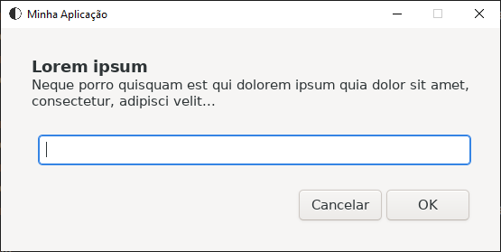

* Numero de linhas na variável `DIALOG_OUTPUT`: 1

### `password`

Permite receber um linha de texto do usuário, o usuário não verá os caracteres

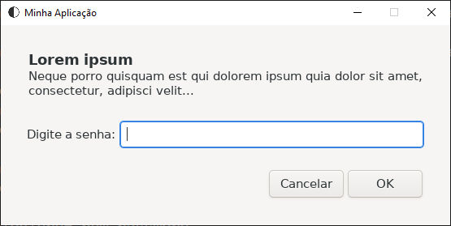

* Numero de linhas na variável `DIALOG_OUTPUT`: 1

### `new-password`

Permite receber um linha de texto do usuário, o usuário não verá os caracteres e só conseguirá prosseguir caso os dois campos sejam iguais

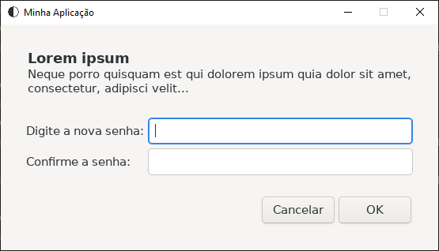

* Numero de linhas na variável `DIALOG_OUTPUT`: 1

### `login`

Possui dois campos um `input` e outro `password` na mesma janela

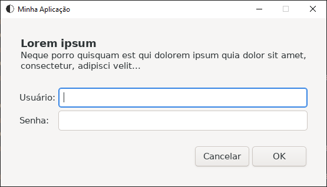

* Numero de linhas na variável `DIALOG_OUTPUT`: 2
* Conteúdo da linha 1: Campo usuário
* Conteúdo da linha 2: Campo senha

### `new-user`

Possui 3 campos um `input` e dois `password` na mesma janela, o usuário só conseguirá prosseguir caso os dois campos `password` sejam iguais

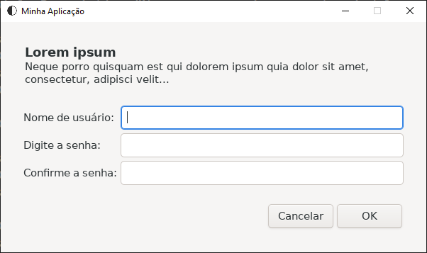

* Numero de linhas na variável `DIALOG_OUTPUT`: 2
* Conteúdo da linha 1: Campo usuário
* Conteúdo da linha 2: Campo senha

### `time`

Possui 2 campos na horizontal do tipo `number`

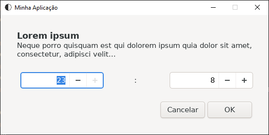

* Numero de linhas na variável `DIALOG_OUTPUT`: 2
* Conteúdo da linha 1: Campo da esquerda
* Conteúdo da linha 2: Campo da direita

### `text-area`

Possui 1 campo do tipo `input` porém permite mais de uma linha

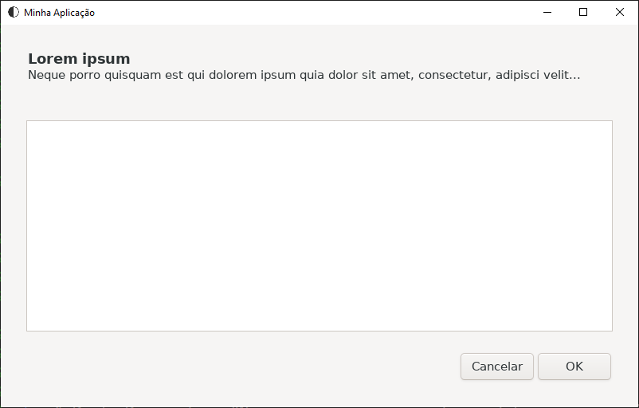

* Numero de linhas na variável `DIALOG_OUTPUT`: indeterminado

> Nota: todo o conteúdo da variável `DIALOG_OUTPUT` corresponde ao que o usuário digitou no campo

### `scale`

Permite escolher um número entre 0 e 100


* Numero de linhas na variável `DIALOG_OUTPUT`: 1

### `double-input`

Possui 2 campos na vertical tipo `input` na mesma janela

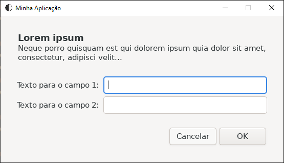

* Numero de linhas na variável `DIALOG_OUTPUT`: 2
* Conteúdo da linha 1: Campo superior
* Conteúdo da linha 2: Campo inferior

> Dica:
> O valores "Texto para campo 1" e "Texto para campo 2" são definidos pelas variáveis `DialogFirstInputLabel` e `DialogSecondInputLabel` respectivamente
